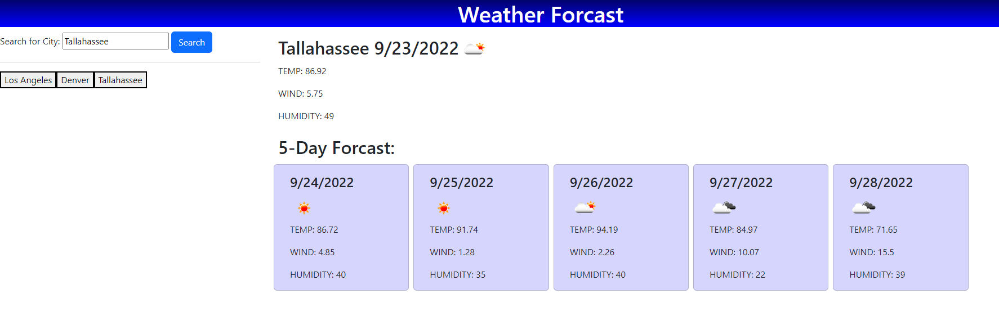

# Weather-App

## Description

I created a weather app that is designed to allow a user to input the name of a city where the weather data for that city comes up for the current day as well as for the upcoming 5 days. City searches will be saved into convenient button links on the right side of the page so the user can click the button for the previously searched cities and see the forcast even after having exited the site.

[Deployed Site](https://angi-adema.github.io/Weather-App/)

## Acceptance Criteria

GIVEN a weather dashboard with form inputs
WHEN I search for a city
THEN I am presented with current and future conditions for that city and that city is added to the search history
WHEN I view current weather conditions for that city
THEN I am presented with the city name, the date, an icon representation of weather conditions, the temperature, the humidity, and the wind speed
WHEN I view future weather conditions for that city
THEN I am presented with a 5-day forecast that displays the date, an icon representation of weather conditions, the temperature, the wind speed, and the humidity
WHEN I click on a city in the search history
THEN I am again presented with current and future conditions for that city

## Technologies

JavaScript
HTML
CSS
